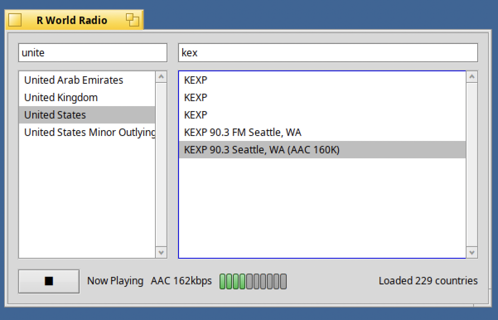

# R World Radio

*[English version](README.md)*



**Haiku OS**(BeAPI) 전용 네이티브 인터넷 라디오 플레이어입니다. 미리 빌드되어 앱에 번들된 방송국 데이터셋(`data/`, radio-browser)을 읽어 국가별로 분류하고, 클릭 시 앱 내부에서 바로 재생합니다 - 별도의 외부 플레이어 프로세스가 없고, 실제 오디오 스트리밍 외에는 네트워크에 전혀 접근하지 않습니다.

> **Haiku OS 전용입니다.** 이 앱은 Haiku 고유 API(Media Kit, 클래식 Network Kit, app_info/BEntry, BAdapterIO)를 직접 사용하므로 macOS, Linux, Windows에서는 빌드도 실행도 되지 않습니다. 실제 Haiku x86_64 nightly(gcc13)를 QEMU에서 구동하여 빌드/검증했습니다.

## 구성

```
src/
  JsonValue.h/.cpp           최소 기능 JSON 파서 (외부 의존성 없음)
  Station.h                  방송국 레코드
  DataSetRepository.h/.cpp   data/countries.json + data/countries/*.json 파싱
  StationCache.h/.cpp        바이너리 옆에서 data/ 위치를 찾아 로드
  NetworkFetch.h/.cpp        BUrlProtocolRoster를 통한 블로킹 HTTP GET - TuneIn 방송국의 Tune.ashx 링크를 재생 시점에 해석할 때만 사용되며, 재생 전에는 그 외 네트워크 접근이 전혀 없음
  M3u8Parser.h/.cpp          HLS 플레이리스트 파서 (마스터 + 미디어 플레이리스트)
  TsDemuxer.h/.cpp           MPEG-TS 디먹서 -> raw ADTS AAC/MPEG-오디오 엘리멘터리 스트림
  HlsAdapterIO.h/.cpp        BAdapterIO 서브클래스: 라이브 HLS 스트림을 가져와 디먹싱한 뒤 일반 프로그레시브 스트림처럼 BMediaFile에 공급 ("HLS 지원" 참고)
  RadioPlayer.h/.cpp         BMediaFile/BMediaTrack/BSoundPlayer 재생 - 일반 스트림은 BUrl 직접 사용, .m3u8은 HlsAdapterIO 사용
  LevelMeterView.h/.cpp      현재 재생 텍스트 옆 피크 레벨 바
  MainWindow.h/.cpp          BWindow: 국가 목록, 방송국 목록, 재생중/상태 표시
  App.h/.cpp, main.cpp       BApplication 진입점
test/
  test_dataset_repository.cpp   실제 data/ 데이터셋을 대상으로 하는 독립 테스트
  test_m3u8_parser.cpp          실제 m3u8 마스터/미디어 플레이리스트 테스트
tools/
  update_stations_db.py     radio-browser로부터 data/ 를 갱신 - 앱 자체 기능이 아니며 개발 머신에서 실행 (아래 참고)
data/
  countries.json            인덱스: [{name, file, count}, ...]
  countries/<slug>.json     국가별 방송국 배열
Makefile                    Haiku makefile-engine 빌드 파일
install.sh                  빌드 후 Deskbar Applications 메뉴에 설치
```

## 요구 사항

- 실행 중인 Haiku OS 환경 (실제 하드웨어 또는 QEMU 등 VM) - 빌드/검증은 x86_64 nightly, gcc13 기반에서 이루어졌습니다.
- Haiku SDK의 개발용 헤더/라이브러리 (표준 Haiku 설치 시 `/boot/system/develop/` 아래에 포함되어 있음).
- 외부 서드파티 의존성 없음 - Haiku 자체 킷(`be`, `tracker`, `network`, `bnetapi`, `media`)과 SDK의 `libnetservices.a`/`libshared.a`만 사용.

## Haiku에서 빌드하기

```
make
```

프로젝트 디렉터리 내 `objects.<arch>-<compiler>-release/` 아래에 `rworldradio` 바이너리가 생성됩니다. `./objects.*/rworldradio` 로 실행하거나 Tracker에서 더블클릭하면 됩니다.

`StationCache`는 `data/countries.json`을 다음 순서로 찾습니다: 바이너리가 있는 디렉터리, 그 한 단계 위(이 프로젝트의 레이아웃과 일치), `~/config/non-packaged/data/RWorldRadio`(아래 "설치" 참고), 마지막으로 현재 디렉터리 기준 `data`. `data/`가 소스와 함께 배포되거나 아래 절차대로 설치되어 있으면 앱을 어떻게 실행하든 찾을 수 있습니다.

링커가 undefined reference 오류를 낸다면 먼저 `Makefile`의 `LIBS` / `SYSTEM_INCLUDE_PATHS` 주석을 확인하세요 - 이 Haiku 빌드에서는 클래식 Url Kit(`BUrlRequest`/`BHttpRequest`)이 `BPrivate::Network` 네임스페이스 안의 `private/netservices`에 있고, 그 구현체는 `libbe.so`처럼 자동으로 링크되지 않는 정적 아카이브(`libnetservices.a` + `libshared.a`)입니다.  이 세부 사항은 Haiku 릴리스마다 다를 수 있습니다.

## Applications 메뉴에 설치하기

```
./install.sh
```

앱을 빌드(`make`)한 뒤 Deskbar의 Applications 메뉴에 심볼릭 링크로 연결합니다. 소스를 새로 받거나 `data/`를 재생성했을 때 다시 실행해도 안전합니다.

내부적으로는 이 작업을 합니다:

```
mkdir -p /boot/system/non-packaged/data/deskbar/menu/Applications
ln -s /path/to/objects.*/rworldradio /boot/system/non-packaged/data/deskbar/menu/Applications/RWorldRadio
mkdir -p ~/config/non-packaged/data
ln -s /path/to/data ~/config/non-packaged/data/RWorldRadio
```

Deskbar의 Applications 메뉴는 실제로는 `/boot/system/data/deskbar/menu/Applications/` 아래 심볼릭 링크들의 모음입니다 (OpenTTD 같은 기본 설치 항목도 여기 링크로 들어가 있습니다). 이 경로 자체는 packagefs로 마운트된 읽기 전용 영역이라, non-packaged 추가 항목은 병렬 구조인 `/boot/system/non-packaged/data/deskbar/menu/Applications/`에 넣으면 packagefs가 읽기 전용 뷰에 병합해줍니다. **실제 시스템에서 확인한 결과: 이 병합은 라이브로 반영되지 않으며, Deskbar를 재시작(`quit application/x-vnd.Be-TSKB`)해도 마찬가지입니다 - 이 디렉터리를 처음 만들 때는 재부팅이 필요합니다.** 그 이후의 재빌드/재설치는 재부팅 없이 반영됩니다.

(`~/config/non-packaged/apps/`는 다른 문서에서 언급되는 것과 달리 이 메뉴를 구동하지 *않습니다* - 실제로 안 되는 것을 확인했습니다.)

`data/`는 바이너리 옆이 아니라 별도의 `non-packaged/data/RWorldRadio` 규칙(Deskbar 메뉴와는 무관한, `StationCache` 자체의 탐색 경로)을 씁니다. (재빌드 시 다시 복사할 필요가 없도록 심볼릭 링크를 사용합니다; 프로젝트 디렉터리를 유지하고 싶지 않다면 `cp`/`cp -r`로 그냥 복사해도 됩니다.)

## 데이터셋 최신 상태로 유지하기

```
python3 tools/update_stations_db.py                  # radio-browser 갱신
```

radio-browser의 전체 카탈로그를 가져와 `data/countries.json`과 모든 `data/countries/<slug>.json`을 다시 씁니다. 인터넷이 되는 개발 머신에서 실행하세요 - Haiku 앱 자체는 이 작업을 하지 않습니다.

## 방송국 소스

- **radio-browser**

## 알고 있는 문제 

- `Makefile`의 `libnetservices.a`/`libshared.a` 경로는 이 Haiku 빌드의 SDK 레이아웃에 하드코딩되어 있으므로 환경이 다르면 조정이 필요합니다.
- `data/`는 반드시 바이너리 옆에 배포되어야 합니다(위 경로 탐색 순서 참고) - 없이 복사하면 "data/countries.json not found next to the app" 오류로 로드에 실패합니다.
- HLS 파이프라인은 일반 MPEG-TS 세그먼트 내의 ADTS AAC와 MPEG 오디오만 처리하며, fragmented MP4/CMAF 세그먼트나 암호화된 스트림 (`#EXT-X-KEY`)은 지원하지 않습니다.

## 라이선스

MIT - [LICENSE](LICENSE) 참고.

