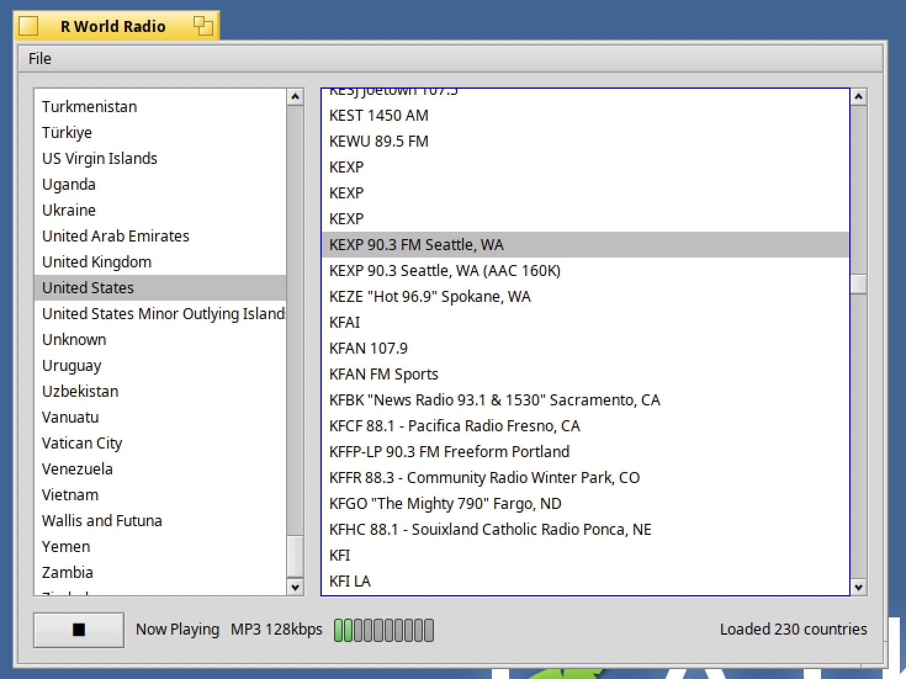

# R World Radio

*[한국어 버전](README.ko.md)*



Native internet radio player for **Haiku OS** (BeAPI). Reads a pre-built, bundled station dataset (`data/`) groups it by country, and plays a station in-process when clicked - no external player process, and no network access at all except to actually stream audio.

> **Haiku OS only.** This app uses Haiku-specific APIs (Media Kit, the classic Network Kit, app_info/BEntry, BAdapterIO) directly and will not build or run on macOS, Linux, or Windows. It has been built and verified running on a real Haiku x86_64 nightly (gcc13) in QEMU.

## Layout

```
src/
  JsonValue.h/.cpp           minimal JSON parser (no third-party dependency)
  Station.h                  station record
  DataSetRepository.h/.cpp   parses data/countries.json + data/countries/*.json
  StationCache.h/.cpp        locates data/ next to the binary and loads it
  NetworkFetch.h/.cpp        blocking HTTP GET via BUrlProtocolRoster - used only to resolve a TuneIn station's Tune.ashx link at play time, nothing else touches the network before playback
  M3u8Parser.h/.cpp          HLS playlist parser (master + media playlists)
  TsDemuxer.h/.cpp           MPEG-TS demuxer -> raw ADTS AAC/MPEG-audio elementary stream
  HlsAdapterIO.h/.cpp        BAdapterIO subclass: fetches/demuxes a live HLS stream and feeds the result to BMediaFile like a plain progressive stream (see "HLS support")
  RadioPlayer.h/.cpp         BMediaFile/BMediaTrack/BSoundPlayer playback - BUrl directly for plain streams, HlsAdapterIO for .m3u8 ones
  LevelMeterView.h/.cpp      simple peak-level bar next to the now-playing text
  MainWindow.h/.cpp          BWindow: country list, station list, now-playing/status App.h/.cpp, main.cpp       BApplication entry point
test/
  test_dataset_repository.cpp   standalone test, runs against the real data/ dataset
  test_m3u8_parser.cpp          standalone test, real m3u8 master/media playlists
tools/
  update_stations_db.py     refreshes data/ from radio-browser - not part of the app, run on a dev machine (see below)
data/
  countries.json            index: [{name, file, count}, ...]
  countries/<slug>.json     per-country station arrays
Makefile                    Haiku makefile-engine build file
```

## Requirements

- A running Haiku OS system (real hardware or a VM, e.g. QEMU) - x86_64 nightly, gcc13-based, is what this was built/verified against.
- The Haiku SDK's development headers/libraries (shipped with any standard Haiku install under `/boot/system/develop/`).
- No third-party dependencies - only Haiku's own kits (`be`, `tracker`, `network`, `bnetapi`, `media`) plus `libnetservices.a`/`libshared.a` from the SDK.

## Building on Haiku

```
make
```

Produces the `rworldradio` binary in the project directory (under `objects.<arch>-<compiler>-release/`). Run it with `./objects.*/rworldradio` or double-click it in Tracker.

`StationCache` looks for `data/countries.json` in, in order: next to the binary's own directory, one level up from it (matching this project's layout), `~/config/non-packaged/data/RWorldRadio` (see "Installing" below), and finally a plain `data` relative to the current directory. It's found regardless of how the app gets launched as long as `data/` ships alongside the source, or the app is installed per the section below.

If the linker complains about undefined references, check the `LIBS` / `SYSTEM_INCLUDE_PATHS` comments in `Makefile` first - this Haiku build put the classic Url Kit (`BUrlRequest`/`BHttpRequest`) under `private/netservices` inside a `BPrivate::Network` namespace, and its implementation is a static archive (`libnetservices.a` + `libshared.a`) that isn't linked automatically the way `libbe.so` is. These specifics may differ across Haiku releases.

## Installing into the Applications menu

Haiku's Deskbar Applications menu lists whatever is in `~/config/non-packaged/apps/` directly, so `data/` must NOT sit next to the binary there (it would show up as a spurious folder entry in the menu) - it goes in the parallel `non-packaged/data/RWorldRadio` convention instead:

```
mkdir -p ~/config/non-packaged/apps
ln -s /path/to/objects.*/rworldradio ~/config/non-packaged/apps/rworldradio
ln -s /path/to/data ~/config/non-packaged/data/RWorldRadio
```

(Symlinks so a rebuild doesn't need re-copying; plain `cp`/`cp -r` works too if you'd rather not keep the project directory around.)

## Keeping the dataset current


```
python3 tools/update_stations_db.py                  # refresh radio-browser
```

This fetches radio-browser's full catalog, then rewrites `data/countries.json` and every `data/countries/<slug>.json`. Run this on a dev machine with internet access - the Haiku app itself never does this.

## Station sources

- **radio-browser**

## Known risk areas

- `libnetservices.a`/`libshared.a` paths in `Makefile` are hardcoded to this Haiku build's SDK layout; adjust if yours differs.
- `data/` must actually ship next to the binary (see the path-search order above) - a copy without it will fail to load with "data/countries.json not found next to the app".
- The HLS pipeline only handles ADTS AAC and MPEG audio inside plain MPEG-TS segments - fragmented MP4/CMAF segments and anything encrypted (`#EXT-X-KEY`) aren't handled.

## License

MIT - see [LICENSE](LICENSE).

